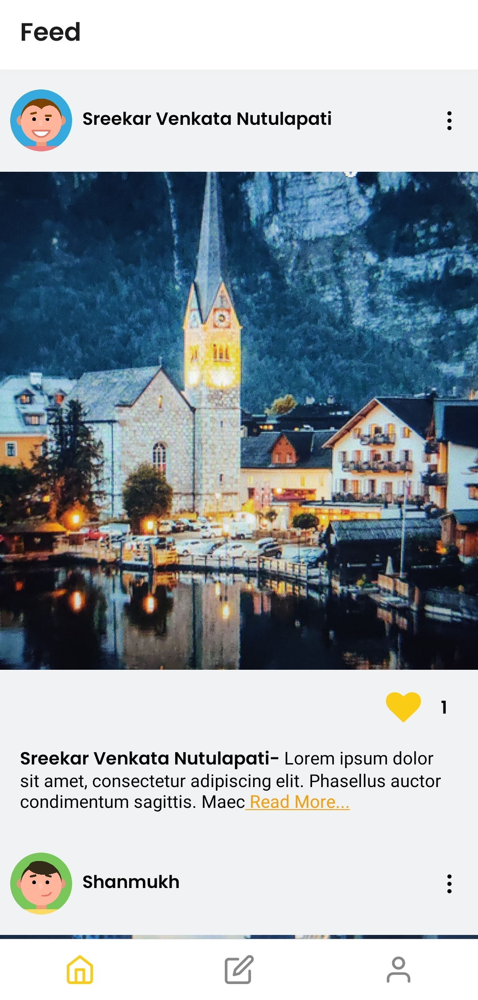
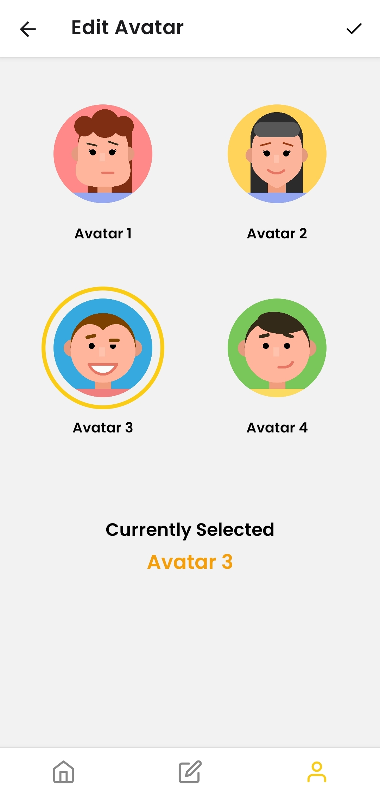

# Instagram

## React Native | Express | Postresql | Graphql | Typescript

|         Feed Screen           |         Edit Avatar Screen    |        Profile Screen         |
| :---------------------------: | :---------------------------: | :---------------------------: |
|  |  |  |

### Installation

create .env files in both server and app folders
(.env.example file is uploaded for reference)

#### Run (both server and app folders)

    yarn or npm install
